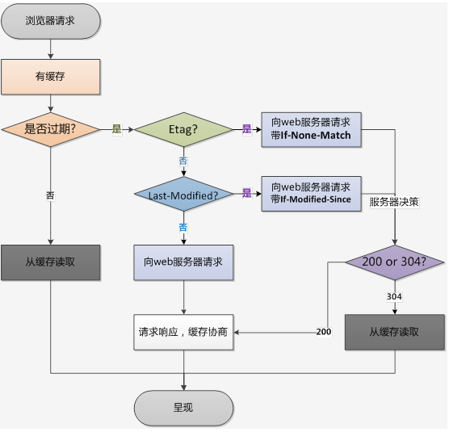

## http

超文本传输协议 


### base


#### status code

- `1xx` 提示信息，协议处理的中间状态 
- `2xx` 服务器成功处理
  - `200` 请求成功
  - `204` 请求成功， 但是响应头没有 body 数据
  - `206` http 分块下载或断点续传, 表示响应返回的body数据并不是资源的全部 
- `3xx` 重定向 请求的资源发生了变化， 需要使用新的url重新发送请求 
  - `301` 永久重定向
  - `302` 临时重定向 说明请求的资源还在，但暂时需要用另一个 URL 来访问
  - `304` 不具有跳转含义，表示资源未修改，重定向已存在的缓存区域 
  - `307` 同302 但不会改变请求方式
  - `308` 同301 但不会改变请求方式
- `4xx` 客户端发送的报文有误, 服务器无法处理
  - `400` bad request
  - `403` forbidden  禁止访问资源
  - `404` 不存在或未找到
- `5xx` 服务器处理时内部发生了错误
  - `500` server error
  - `502` bad gateway 网关或代理返回错误码


相关问题:
 
##### 301 & 302

301 永久重定向 资源永久移动
302 临时重定向 资源暂时移动 

相同: 
  - 都会在响应头里使用字段 Location 指明后续需要跳转的url，浏览器会自动重定向到新的url 
  - post请求都会被浏览器转为get请求 

*缓存时间*
- 301 不同浏览器处理不同 chrome默认永久缓存 safari重启后清除
- 302 默认不缓存
- 都可以在指定 cache-control expires时 设置缓存

*seo*
  - 301 会抓取定向后的 并保存新网址
  - 302 会抓取定向后的内容 但是还会将网址保存为原网址
  - 安全问题 302会保存原有地址， 可能出现网址劫持 
  - 307 临时重定向
  - 308 永久重定向


##### 重定向 相关

*出现场景*
1. html tag 
  ``` 
    <head>
      <meta http-equiv="Refresh" content="0; URL=https://www.baidu.com/">
    </head>
  ```
2. js ```window.location```
3. http 重定向 ，http header中有 location 字段

*nginx.conf配置*
```
server {
    listen : 8081;
    server_name : www.a.com;
    location / {
        root : /www;
        index index.html;
    }
    rewrite ^(.*) http://www.b.com permanent; // 301永久重定向
}
```


#### header

常见 http header:
- Accept: 接收内容类型， 如 text/plain,text/html
  - Accept-Charset
  - Accept-Encoding
  - Accept-Language
- Authorization: web服务器 身份验证信息
- Access-Control-Allow CORS跨越使用
  - *-Headers
  - *-Methods
  - *-Origin
  - *-Headers
- cache-Control 强缓存
  - no-cache 强制客户端向服务器发起请求（禁用强缓存，可用协商缓存）
  - no-store  不允许缓存
  - public 任何人都可以缓存
  - private 只能被用户缓存，不能被代理服务器缓存
  - max-age=seconds 设置缓存的最大周期
  - s-max-age=seconds 代理端缓存， 私有缓存会忽略
- connection 控制当前网络连接状态
  - close
  - keep-alive
- content-type 指示资源的原始媒体类型
  - 媒体类型 MIME
    - text/html
    - application/x-www-form-urlencoded
    - multipart/form-data
- cookie
- ETag/If-None-Match
- Last-Modified/If-Modified-Since
  - `Last-Modified: Wed, 21 Oct 2015 07:28:00 GMT`
- Expires=http-date 相应过期日期/时间
- keep-alive 连接状态，可用来设置超时时长和最大请求数
- Location 重定向使用
- range 告知服务器返回文件的哪部分
- referer 当前请求页面的来源页地址


#### method

1. get
2. post
3. head
4. options 预检， cors请求时，先预请求，确认是否支持跨域
5. put
6. delete


常见问题：
- get & post
  - 语义
  - 参数传递方式
  - 传输数据大小
  - 安全
  - 缓存
- post 编码格式 即 Content-Type 可查http-header

#### cache




小结:  

*强缓存*
HTTP-Header:  cache-control > Expires
  - expires HTTP/1 ， value 为 时间
  - cache-control HTTP/1.1 ，可由多个指令组成
    + max-age= 30  对比时间为请求资源时间
    + no-catch  允许本地缓存，但需要先进行协商缓存
    + no-store 禁用缓存 


*协商缓存*
HTTP-Header:  Last-Modified < ETag
  - Last-Modified 上次修改时间， 文件被打开也会变化
  - ETag 类似于文件指纹，

etag生成:
  - 静态文件, 时间戳+文件大小的16进制
  - buffer字符串， 长度+对应的hash

*no-cache、no-store 的区别*  
  - no-cache 和 no-store 这两个指令在请求和响应中都可以使用
  - no-store 是真正的不进行任何缓存，告知服务器和缓存服务器，我请求、响应的内容里有机密信息；
  - 当 no-cache 在请求头中被使用时，表示强制使用协商缓存
  - 当 no-cache 在响应头中被返回时，表示缓存服务器不能对资源进行缓存，客户端可以缓存资源，但每次使用缓存资源前都必须先向服务器确认其有效性


启发式缓存:
如果 Expires，Cache-Control: max-age，或 Cache-Control: s-maxage 都没有在响应头中出现，并且设置了Last-Modified时

ETag 在标识前面加 W/ 前缀表示用弱比较算法（If-None-Match 本身就只用弱比较算法）。
ETag 还可以配合 If-Match 检测当前请求是否为最新版本，若资源不匹配返回状态码 412 错误（If-Match 不加 W/ 时使用强比较算法）

### cookie

常见字段:
  - value 如果用于保存用户登录态，应该将该值加密，不能使用明文的用户标识
  - http-only  不能通过 JS 访问 Cookie，减少 XSS 攻击
  - secure 只能在协议为 HTTPS 的请求中携带
  - same-site 规定浏览器不能在跨域请求中携带 Cookie，减少 CSRF 攻击
    - Strict：完全禁止第三方 Cookie。
    - Lax：只允许链接、预加载请求和 GET 表单的场景下发送第三方 Cookie。
    - None：关闭 SameSite 属性。
  - expires
  - max-age 时间戳

### HTTP/1.1

1. 持久连接
2. 管道化传输
3. 分块编码传输
4. 新增host字段
5. 引入协商缓存机制

存在问题：
1. 队头阻塞
2. 头部冗余
3. tcp连接数限制

#### 持久连接

一个TCP连接中发送和接收多个 Http 请求/响应

#### 管道化传输

HTTP 管道化是指将多个 HTTP 请求同时发送给服务器的技术，但是响应必须按照请求发出的顺序依次返回 

问题:
1. 前面的响应慢会阻塞后面的
2. 服务器为了保证能按序返回需要缓存提前完成的响应而占用更多资源

*队头阻塞*
顺序发送的请求序列中一个请求因某种原因被阻塞，后面排队的所有请求也一同被阻塞  

#### 分块编码传输

在 HTTP/1.1 协议里，允许在响应头中指定 Transfer-Encoding: chunked 标识当前为分块编码传输，可以将内容实体分装成一个个块进行传输。  
好处：
1. 允许服务器为动态生成的内容维持HTTP持久链接
2. HTTP服务器有时使用压缩（gzip）以缩短传输花费的时间，边压缩边传

#### 新增host字段

在1.0中认为每台服务器都绑定一个唯一的ip地址 
单随着虚拟主机技术发展， 可同时存在多个虚拟主机，共享一个IP


### HTTP/2

主要改进:
1. 多路复用
2. 头部压缩
3. 二进制格式
4. 数据流传输
5. 服务端推送

存在问题：
1. 无法解决TCP队头阻塞
2. 握手需要时间


#### 头部压缩

使用`HPACK`算法 压缩头部内容，减少包体积  
算法： 在服务端和客户端同时维护一张头信息表，所有字段都会存在这个表，生成一个索引号，以后只发送索引号和有更改的部分
  - 静态字典表  包含常见的61中高频头部字符串
  - 动态编码表

#### 二进制格式 

将纯文本形式报文 更换为 二进制格式 
头信息和数据体都是二进制，统称为 帧

如: `200` 文本为 `'2''0''0'` 

#### 数据流
通过数据流的方式，并行发送数据

每个http请求都有一个唯一的streamID，在一个 TCP 连接中可同时存在多个stream同时存在，然后接收方根本streamID有序组装成HTTP消息

#### 服务端推送

server push 


### HTTP/3

基于 `UDP` 实现的 `QUIC` 协议  
主要特点:
- 无队头阻塞
  - 当某个流发生丢包时，只会阻塞这个流，其他流不会受到影响，因此不存在队头阻塞问题
- 更快的建立连接
  -  QUIC 内部包含了 TLS，它在自己的帧会携带 TLS 里的“记录”


- 多路复用
- 数据可靠
- 快速握手
- TLS 加密


## https

通过CA证书校验来保证
通过混合加密的方式进行内容传输 防止信息被读取或篡改

### http/https

区别：
1. 安全性
  - http 明文传输，存在安全风险
  - 在 tcp 和 http 网络层之间加入了 SSL/TLS安全协议, 对报文进行加密
2. 连接建立
  - https 需要在tcp握手后，在进行SSL/TLS握手
3. 端口 80/443
4. HTTPS 需要向 CA 机构申请数字证书 

### 加密&证书

*加密方式*
混合加密: 对称加密结合非对称加密
  - 非对称加密方式交互 会话秘钥
  - 使用 会话秘钥 对后续会话进行加密

*非对称加密*
- 私钥加密， 公钥解密


*证书颁发*
1. 对证书内容进行hash计算
  - 持有者公钥 用途 颁发机构 签名 有效期
2. 使用私钥对hash进行加密 生成签名
3. 将签名添加到证书上，形成数字证书

*证书验证*
1. 校验证书的有效期  域名是否有效
2. 校验颁发机构是否可信
  - 验证颁发机构为信任链特性
    - root机构内置在os系统中
    - 然后一级一级信任
3. 取颁发机构的公钥 对证书的签名进行解密
4. 用相同的算法对证书进行hash 与解密后的值比对


### TLS 握手

*版本*
主流1.2 4次握手
1.3 将 hello 和 公钥交换 合成一个消息 仅需1RTT就完成握手 


不同版本 秘钥交换和身份验证可能不同， 其中TLS1.2使用DH
主要 RSA DH两种

主要流程:
1. 客户端，TLS版本号，支持的密码套件列表 随机数
2. 确认TLS版本号 选择一个密码套件，生成一个随机数
  - 发送数字证书 
3. 客户端验证证书 
  - 生成随机数  使用服务端公钥加密 发送服务端
  - 这三个随机数 生成会话秘钥，即为对称秘钥
  - 发送通知 告知后续开始加密
  - 对之前所有的数据做摘要，用会话秘钥加密，发送 Finishd 信号 
4. 服务器验证 
  - 发送通知 告知后续开始加密
  - 用会话秘钥加密，发送 Finishd 信号 

流程简述:
双方协商使用的协议版本，加密算法等细节
服务器发送 证书 给客户端
客户端校验证书有效性
双方根据握手的一些参数生成一个对称秘钥，此后所有的内容使用这个秘钥来加密


密码套件: 秘钥交换算法 签名算法 对称加密算法 等 


### 相关问题

1. 为什么需要CA机构: 保证证书的安全性， 防止 中间人攻击
2. 对称和非对称的好坏:  非对称安全， 对称性能高
3. 为什么安全: 采用数据加密的方式，防止传输过程被监听 数据被窃取
4. 为什么需要证书: 为网站提供身份证明， 防止中间人攻击
5. 会被抓包吗: 在用户主动授信的情况， 可以构建中间人网络，实现抓包

并非完全安全：
1. ssl剥离
2. 攻击dns伪造证书等 

#### SSL 剥离

一种网络攻击，阻止用户使用 HTTPS 访问网站，将 Web 连接从更安全的 HTTPS 降级到安全性较低的 HTTP

方法:
- 代理服务器
- arp欺骗
- 网络访问: 公共wifi


## other

### with RPC

RPC（Remote Procedure Call），又叫做远程过程调用

区别:
1. 服务发现 不需要通过 DNS 查找IP
2. 底层连接 通过连接池
3. 传输内容更加定制化， 无冗余头部信息


### webSocket

基于TCP实现的全双工通信协议  

*就与http建立连接*
1. 使用http完成三次握手
2. 发起 websocket 建立请求
  ```
    Connection: Upgrade
    Upgrade: WebSocket
    Sec-WebSocket-Key: T2a6wZlAwhgQNqruZ2YUyg==\r\n
  ```
3. 返回 httpcode=101 切换协议， 之后就可以使用ws wss通信 

