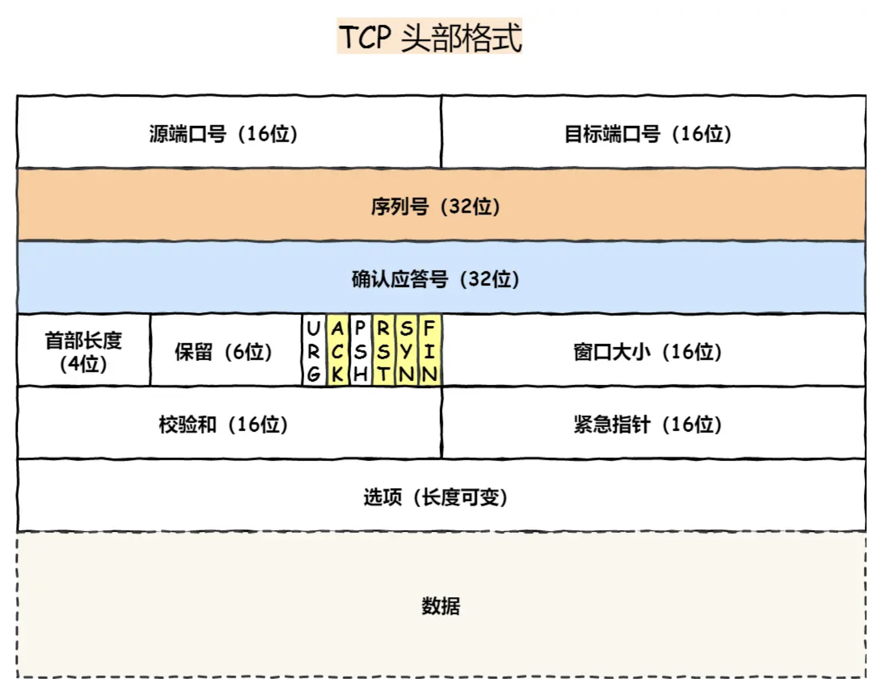

## TCP
传输控制协议
面试连接、可靠的、基于字节流的传输层通信协议 

### TCP 头部组成

*头部格式*
- 源端口号16+目标端口号16
- 序列号32
- 确认应答号32
- 首部长度4 + 保留6 + URG+ACK+PSH+RST+SYN+FIN + 窗口大小16
- 校验和16 + 紧急指针16
- 选项

- *序列号* seq: 在建立连接时生成的随机数作为其初始值，通过syn包传给接收端, 没发送一次数据就累加一次该「数据字节数」大小，用来解决*网络包乱序问题*
- *确认号* ack: TCP对上一次seq序号做出的确认号，用来响应TCP报文段，给收到的TCP报文段的序号seq加1, 用来解决*丢包问题*
- *控制位*
  - SYN：简写为S，同步标志位，用于建立会话连接，同步序列号；
  - ACK： 简写为.，确认标志位，对已接收的数据包进行确认；
  - FIN： 简写为F，完成标志位，表示我已经没有数据要发送了，即将关闭连接；
  - PSH：简写为P，推送标志位，表示该数据包被对方接收后应立即交给上层应用，而不在缓冲区排队；
  - RST：简写为R，重置标志位，用于连接复位、拒绝错误和非法的数据包；
  - URG：简写为U，紧急标志位，表示数据包的紧急指针域有效，用来保证连接不被阻断，并督促中间设备尽快处理；

### 可靠性

主要通过以下实现:
  - 连接管理 三次握手/四次挥手
  - 数据包序列号&确认应答机制 
  - 重传机制
  - 流量控制
  - 拥塞机制

#### 连接管理

通过三次握手建立一个可靠的连接，这个过程确保双方都准备好接收和发送数据，并同意初始化序列号，从而开始可靠的数据传输  
在传输过程中，通过四次挥手正常终止连接，确保最后的数据能够完整传输。

##### 三次握手

1. 客户端发起请求， 包含 syn 标志位1 随机序列号 seq 客户端进入`SYN_SENT`状态
2. 服务端接收，开启一个socket端口， 返回syn=1 ACK=1 随机序列号 确认号seq+1 进入`SYN_RCVD`等待
3. 客户端根据 控制位为ack=1, 确认序列号为ack+1, 进入连接状态，服务端接收到后也进入连接状态

相关问题:
1. 为什么三次？
  - 确保双方都有接收和发送能力的最小次数
  - 避免以下问题:
    - 防止旧的历史连接初始化造成混乱(如：网络堵塞)
    - 同步双方初始序列号
    - 避免资源冗余
2. 第三次可以传送内容
3. 初始序列号随机
  - 防止历史报文被重新利用
  - 安全考虑， 防止伪造信息
4. 随机数生成 时间+hash(mac ip mss)
5. mss mtu
  - mtu 一个网络包的长度，以太网一般1500字节内
  - mss 去除ip和tcp头部后，内容的大小
6. 第一次失败 
  - 第一次超时后， 后重传相同的包， 不同操作系统超时时间为1s 3s不同， 再次失败后时间翻倍，超过最大重传次数后断开tcp连接
7. 第二次失败 
  - 双方都会进行重传
8. syn攻击
  - 第一次握手后， 接收端会将连接放入半连接队列(SYN队列),队列打满后，接受的连接会丢失
  - 解决方式
    - 增加队列大小
    - 减少重传次数
    - 使用tcp_syncookie, 不经过syn队列

##### 四次挥手

流程：
1. 客户端打算关闭时， 发送首部表示位fin=1， 进入`FIN_WAIT`
2. 接受后， 进入 `CLOSE_WAIT`， 返回报文
3. 发送完所有文件后， 发送 FIN=1, 进入`LAST_CK`
4. 客户端接收后发送确认， 2msl后自动关闭， 服务端接收后直接关闭

相关问题：
1. 为什么2MSL
  - MSL 报文最大生存时间， 允许报文丢失一次 
  - 保证客户端发送的最后一个ACK报文段能够到达服务端
  - 防止“已失效的连接请求报文段”出现在本连接中

#### 序列号和确认应答机制 
  
传输过程中通过分包进行传输，每个包都包含序列号和确认序列号 

发送方按序对将数据分割成多个报文段，并发送到网络中 
接收方通过确认序列号告知已成功接收数据，
如果超过规定时间未收到确认应答，会重新发送对应数据 

序列号作用：
- 接收方去除重复数据
- 接收方可根据序列号按序接收
- 发送方根本序列号确认是否已传

#### 重传机制
重复的触发分为以下：
- 超时重传
- 快速重传
- 选择确认的重传 SACK
- 重复SACK

##### 超时重传

每个包在发送时都会有个定时器， 超过指定时间未接收到确认，就是重新发送：
- 数据包丢失
- 确认相应丢失

RTO(超时时间)计算
根据往返时间计算， 如果超时， 则时间加倍， 超过两次说明网络差，不宜频繁重传

##### 快速重传   

通过数据判断  
接收为按序接收 ，当接收到三个相同的ack后，会进行重传 

##### SACK 选择性确认

tcp头部会添加一个 SACK 。用来将已收到的数据信息发送给 发送方 

##### D-SACK

接收方 使用 SACK 告知 发送方 那些数据被重复接收了

##### 滑动窗口 

在传输过程中， 采用滑动窗口的方式， 无需等待确认应答，而可以继续发送数据  
窗口大小: 由接收方的窗口大小来决定的， 发送方的不能超过接收方的窗口大小

#### 流量控制 

协调发送方和接收方之间的数据传输速率，确保发送方不会发送过多的数据，导致接收方的缓冲区溢出。

发送和接收窗口都是在操作系统的缓冲区， 大小是会被操作系统调整 

先缩小缓存后缩减窗口大小， 避免数据丢失 

#### 拥塞机制 

通过算法控制发送频率， 避免数据充满网络  
通过拥塞窗口 调节所要发送的数据量
主要算法:
- 慢启动
- 避免拥塞
- 拥塞发生
- 快速恢复

##### 慢启动

当发送方每收到一个 ACK，拥塞窗口 cwnd 的大小就会加 1。
窗口大小指数级增长  

##### 避免拥塞

拥塞窗口大小超过`慢启动门限`限度后, 增长方式就会变成线性增长 

##### 拥塞发生 

网络拥塞会出现丢包， 也就会发送数据重传

超时重传时，拥塞窗口将至1，重新开始慢启动 
快速重传时， 窗口大小减半， 进入快速恢复算法 

##### 快速恢复

### 相关问题

1. 每次建立连接， 初始序列号都不同
  - 防止历史报文被重新利用
  - 安全考虑， 防止伪造信息

2. https 的 TLS 握手在 TCP三次握手后进行，特定情况时同时进行(开发 TCP fast open & TLS v1.3)

#### keep-alive

*HTTP  Keep-Alive*
  - 是由应用层（用户态） 实现的，称为 HTTP 长连接
  - 目的
    - 一个TCP连接 发送/接收 多个http请求/应答
    - 减少 http短连接 带来的多次 TCP 连接建立和释放带来的开销
*TCP Keepalive*
  - 是由 TCP 层（内核态） 实现的，称为 TCP 保活机制
  - 长时间无数据交互，内核为了确保是否有效， 发送探测报文

#### TCP 部分缺陷

1. 建立连接有延迟 
  - 三次握手
  - https TLS 四次握手 
2. 队头阻塞
  - TCP 是基于字节流且保证收到的字节数据是完整且有序的
  - 在传输过程中，序列号较小的包丢失，会等待重传后，再将有序的数据传给应用层
  - 即使后面序列号较大的包已经接收到， 也不会传递给应用层
3. 网络迁移需要重新建立连接 

## UDP

用户数据报协议  
  - 传输层无连接协议 
  - 不保证数据可靠到达或顺序性 

### 工作原理

1. 无连接通信
2. 数据报传输
3. 最佳努力传输 
4. 端到端通信: 使用端口号识别不同应用程序 

### header

仅 8字节:
  - 源端口（Source Port）	2	发送方应用的端口号
  - 目的端口（Destination Port）	2	接收方应用的端口号
  - 长度（Length）	2	包括头部和数据的总长度
  - 校验和（Checksum）	2	检测数据的完整性

## TCP / UDP

*区别*
  - 传输方式
    - 面向字节流，将数据看做一连串字节，按顺序传输
    - 面向报文，每次传输独立的数据报，数据报大小一致
  - 连接方式
    - 面向连接，需要在通信前先建立连接
    - 直接发送数据
  - 可靠性
    - 保证数据包按顺序到达、不丢失、不重复
    - 不保证
  - 速度和开销
    - 慢，开销大，需管理连接状态和保证可靠性
      - 首部开销大，至少20字节
    - 快，开销小
      - 首部仅8字节
   - 流控制与拥塞
    - 支持，根据网络状态调整传输速度
    - 不支持