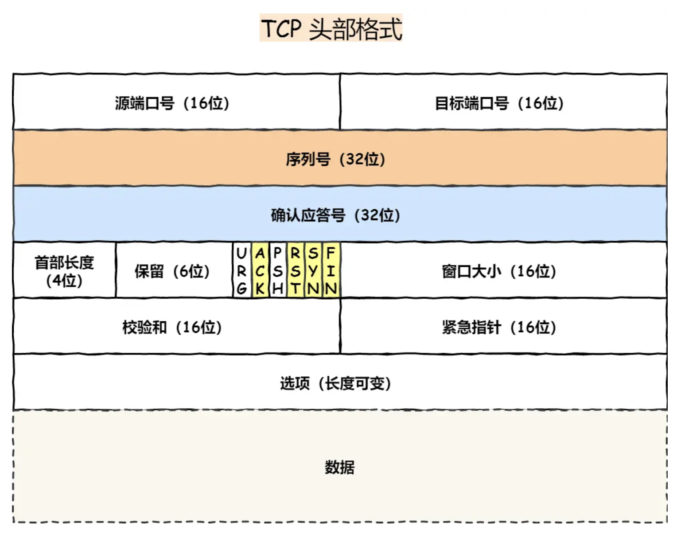

## 网络基础

### OSI 模型

- 物理层 定义物理设备如何传输数据 0 1 
- 数据链路层 实体间创建数据链路连接
- 网络层 地址管理 路由选择 ip
- 传输层  两个节点间的数据传输 tcp udp
- 会话层 通信管理，负责建立和断开通信连接
- 表示层 设备固有数据格式和网络标准数据格式的转换
- 应用层 对特定应用的协议：电子邮件->电子邮件协议，远程登陆，文件传输等

### 五层模型
- 应用层 http ftp telnet smtp websocket
- 传输层 tcp udp
- 网络层
      - Internet 协议 IP
      - Internet 控制信息协议 ICMP
      - 地址解析协议 ARP
      - 反向地址解析协议 RARP
- 数据链路层
- 物理层

## 网络层协议 TCP/UDP

### TCP
传输控制协议（TCP，Transmission Control Protocol） 
是一种面向连接的、可靠的、基于字节流的传输层通信协议

主要特点：
- 基于流的方式
- 面向连接
- 丢包重传
- 保证数据顺序

#### TCP 包 首部

- *序列号* seq: 在建立连接时生成的随机数作为其初始值，通过syn包传给接收端, 没发送一次数据就累加一次该「数据字节数」大小，用来解决*网络包乱序问题*
- *确认号* ack: TCP对上一次seq序号做出的确认号，用来响应TCP报文段，给收到的TCP报文段的序号seq加1
- *控制位*
- SYN：简写为S，同步标志位，用于建立会话连接，同步序列号；
- ACK： 简写为.，确认标志位，对已接收的数据包进行确认；
- FIN： 简写为F，完成标志位，表示我已经没有数据要发送了，即将关闭连接；
- PSH：简写为P，推送标志位，表示该数据包被对方接收后应立即交给上层应用，而不在缓冲区排队；
- RST：简写为R，重置标志位，用于连接复位、拒绝错误和非法的数据包；
- URG：简写为U，紧急标志位，表示数据包的紧急指针域有效，用来保证连接不被阻断，并督促中间设备尽快处理；

#### 可靠性

主要:
- 连接管理  三次握手/四次挥手
- 数据包序列号&确认应答机制 
- 重传机制
- 流量控制
- 拥塞机制

### UDP
Internet 协议集支持一个无连接的传输协议，该协议称为用户数据报协议（UDP，User Datagram Protocol）  
UDP 为应用程序提供了一种无需建立连接就可以发送封装的 IP 数据包的方法

主要特点: 
- 是非连接的协议，也就是不会跟终端建立连接
- 包信息只有 8 个字节
- 是面向报文的。既不拆分，也不合并，而是保留这些报文的边界
- 可能丢包
- 不保证数据顺序

### diff

主要区别: 
1. 连接性 面向连接/无连接
2. 可靠性 
3. 传输形式 流/数据报
4. 传输速度
5. 头部开销

具体:  
1. 连接性
TCP: 面向连接的协议。在传输数据之前，TCP需要先建立一个连接（通过“三次握手”），确保双方都准备好通信。传输结束后，需要通过“四次挥手”断开连接。
UDP: 无连接的协议。UDP在发送数据之前不需要建立连接，直接将数据包发送出去，适合需要快速传输和低延迟的应用。
2. 可靠性
TCP: 提供可靠的数据传输服务。TCP通过序列号、确认机制、重传机制、流量控制和拥塞控制，确保数据包按顺序、无误地到达目的地。
UDP: 不保证数据的可靠传输。UDP不提供重传机制，也没有顺序控制，如果数据包丢失或到达顺序错误，应用层需要自行处理。
3. 传输速度
TCP: 由于其需要建立连接、维护连接状态，并且有流量控制和重传机制，因此传输速度相对较慢。
UDP: 传输速度较快，因为它没有连接建立和维护的开销，也没有重传机制和流量控制。
4. 数据流形式
TCP: 是流模式传输，即数据以字节流的形式传输。TCP会将数据划分成适当大小的片段进行传输，接收方再重新组装成完整的数据流。
UDP: 是数据报模式传输，即数据以独立的数据报形式传输，每个数据报是一个完整的消息，大小是固定的（通常不超过65,535字节）。
5. 使用场景
TCP: 适用于对数据传输可靠性要求高的场景，如文件传输（FTP）、网页浏览（HTTP/HTTPS）、电子邮件（SMTP、IMAP、POP3）等。
UDP: 适用于对速度和实时性要求高但对传输可靠性要求较低的场景，如实时视频和音频传输（VoIP、视频会议）、在线游戏、DNS查询等。
6. 头部开销
TCP: 头部开销较大，至少20字节，因为需要携带更多的控制信息（如序列号、确认号、窗口大小等）。
UDP: 头部开销较小，只有8字节，因为它只包含必要的信息（如源端口、目的端口、长度和校验和）。
这些区别使得TCP和UDP适用于不同的应用场景，根据需要选择合适的协议可以优化网络性能和用户体验。

## 