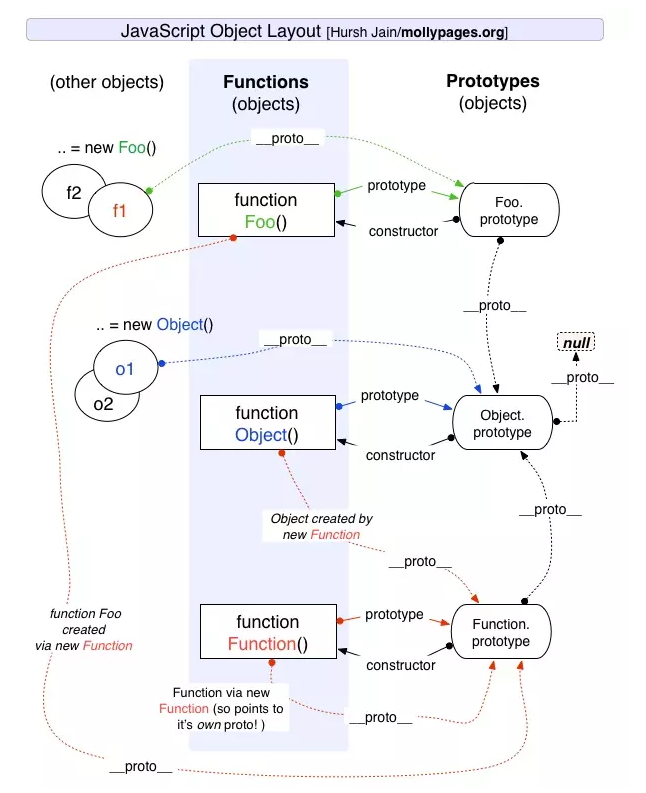

## prototype

原型: 每个js对象(除null)在创建时会关联另一个对象，并从这个对象继承部分属性,这个对象就是原型


其中:
  - `__proto__` 实例->原型对象
  - `constructor` 原型对象->构造函数
  - `prototype` 构造函数->原型对象
  - `new` 构造函数->实例

函数: 
  ```js
    function doSomething(){}
    // console
    {
        constructor: ƒ doSomething(),
        __proto__: {
            constructor: ƒ Object(),
            hasOwnProperty: ƒ hasOwnProperty(),
            isPrototypeOf: ƒ isPrototypeOf(),
            propertyIsEnumerable: ƒ propertyIsEnumerable(),
            toLocaleString: ƒ toLocaleString(),
            toString: ƒ toString(),
            valueOf: ƒ valueOf()
        }
    }
  ```


关系图如下:




## prototype chain

查找流程: ```person -> Person.prototype -> Object.prototype -> null``` 

原型链: 原型间组成的链状结构

在读取实例的属性时,如果查找不到,就会查找与之关联的原型的对象上的属性，继续查找原型对象的原型对象,知道查到或者查到`null`  


## operate prototype

构造函数与原型之间的关系:
  ```
    Person(constructor) -> new -> person(instance)
    person(instance) -> __proto__ -> Person.prototype(prototype)
    Person(constructor) —> prototype -> Person.prototype(prototype)
    Person.prototype(prototype) -> constructor -> Person(constructor)
  ```

1. 查找原型
  - `__proto__` deprecated
  - `Object.getPrototypeOf(obj)`
  - `Reflect.getPrototypeOf(obj)`
2. 设置原型
  - `new`
  - `Object.create()`
  - `Object.setPrototypeOf(obj)`
  - `Reflect.setPrototypeOf(obj)`

## inheritance

### es5

  ```js
  // 1. 原型继承
  function Cat (name) {}
  Cat.prototype = new Animal()

  // 2. 构造函数继承
  function Cat (name) {
    Animal.call(this, name)
  }
  var cat = new Cat('name')

  // 3. 组合寄生继承
  // 借用构造函数来继承属性，使用混合式原型链继承方法

  function Cat (name) {
    Animal.call(this, name)
  }

  (function () {
    let Super = function () {}
    Super.prototype = Animal.prototype
    Cat.prototype = new Super()
    Cat.prototype.constructor = Cat
  })()
  ```

### es6

  ```js
  class Animal {
    constructor (name) {
      this.name = name
    }
  }

  class Cat extends Animal {
    constructor (name) {
      super(name)
    }
  }
  ```

