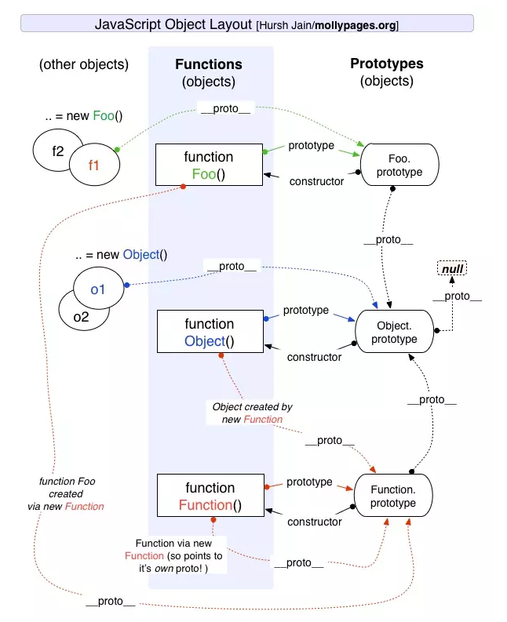

## prototype

每个对象都会有一个私有属性指向另一个名为原型的对象
原型: 每个js对象(除null)在创建时会关联另一个对象，并从这个对象继承部分属性,这个对象就是原型


其中:
  - `new` 构造函数 -> 实例
  - 实例 `__proto__` -> 原型对象
  - 原型对象 `constructor` -> 构造函数
  - 构造函数 `prototype` -> 原型对象

函数: 
  ```js
    function doSomething(){}
    // -> console
    {
        constructor: ƒ doSomething(),
        __proto__: {
            constructor: ƒ Object(),
            hasOwnProperty: ƒ hasOwnProperty(),
            isPrototypeOf: ƒ isPrototypeOf(),
            propertyIsEnumerable: ƒ propertyIsEnumerable(),
            toLocaleString: ƒ toLocaleString(),
            toString: ƒ toString(),
            valueOf: ƒ valueOf()
        }
    }
  ```


关系图如下:



## prototype chain

*原型链*
原型间，对象继承时的链状关系

*查找规则*
- 实例本身查找属性找不到时，去原型上查看
- 原型上找不到，去原型的原型上查找
- 直到 找到 或 查到 null
如: ```person -> Person.prototype -> People.prototype -> Object.prototype -> null```

## operate

构造函数、实例、原型关系
  ```js
    Person(constructor) -> new -> person(instance)
    person(instance) -> __proto__ -> Person.prototype(prototype)
    Person(constructor) —> prototype -> Person.prototype(prototype)
    Person.prototype(prototype) -> constructor -> Person(constructor)
  ```

*查找原型*
  - `__proto__`
  - `Object.getPrototypeOf(obj)`
  - `Reflect.getPrototypeOf(obj)`

*设置原型*
  - `new`
  - `Object.create(proto, propertiesObject)`
  - `Object.setPrototypeOf(obj)`
  - `Reflect.setPrototypeOf(obj)`


## inheritance

### es5

1. 原型继承
  ```js
    function Cat (name) {}
    Cat.prototype = new Animal()
  ```
2. 构造函数继承
  ```js
    function Cat (name) {
      Animal.call(this, name)
    }
    var cat = new Cat('name')
  ```
3. 组合-es5
  ```js
    function Cat (name) {
      Animal.call(this, name)
    }
    (function () {
      let Super = function () {}
      Super.prototype = Animal.prototype
      Cat.prototype = new Super()
      Cat.prototype.constructor = Cat
    })()
  ```
4. 组合-es6
  ```js
    function Cat (name) {
      Animal.call(this, name)
    }
    Cat.prototype = Object.create(Animal.prototype);
    Cat.prototype.constructor = Cat;
  ```

### es6

  ```js
    class Animal {
      constructor (name) {
        this.name = name
      }
    }
  
    class Cat extends Animal {
      constructor (name) {
        super(name)
      }
    }
  ```

## new

在`JavaScript`中，`new`操作符用于创建一个给定构造函数的实例对象 

执行了以下步骤: 
  1. 创建一个空对象 
  2. 绑定原型
    - 如果构造函数的原型是对象 那么绑定这个对象
    - 否则指向 Object.prototype
  3. 绑定this 
  4. 返回新对象 
    - 非原始值 或者 newInstance


### polyfill new

  ```js
    function newObject (context, ...args) {
      const obj = Object.create(context.prototype)
      let res = context.call(obj, ...args)
      return typeof res === 'object' && res != null ? res : obj
    }
  ```

### new.target

检测函数或构造方法是否是通过new运算符被调用的
- 在普通函数中调用 为undefined
- 在箭头函数中，指向最近的外层函数new.target
- 在构造函数中使用，指向被 new 的函数, 非继承的对象

  ```js
    function Foo() {
      if (!new.target) throw "Foo() must be called with new";
      console.log("Foo instantiated with new");
    }

    Foo(); // throws "Foo() must be called with new"
    new Foo(); // logs "Foo instantiated with new"
  ```
